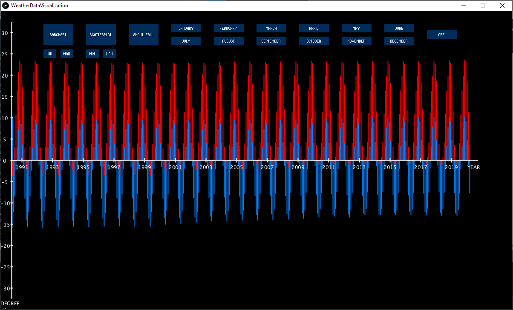
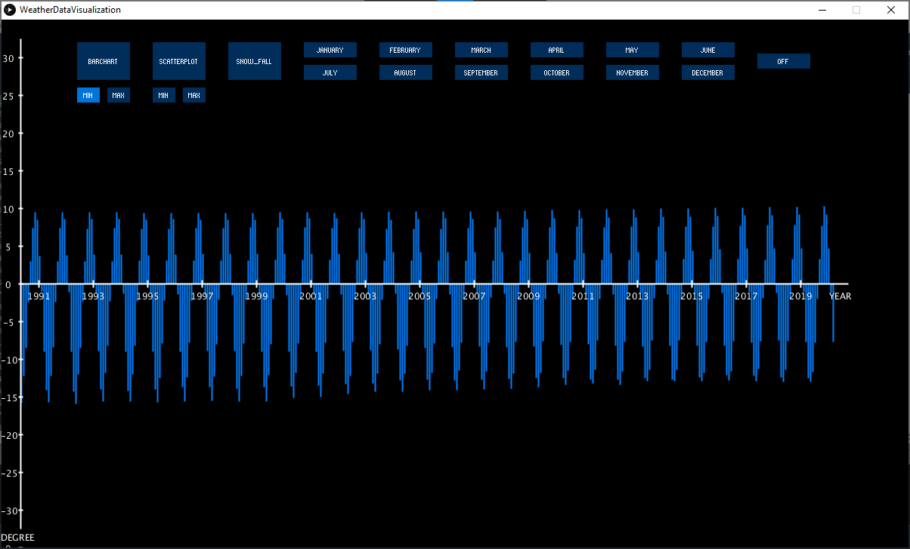
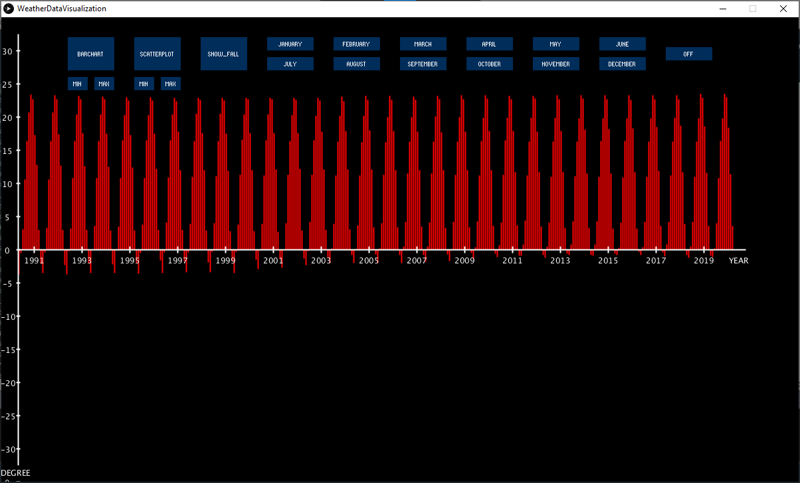
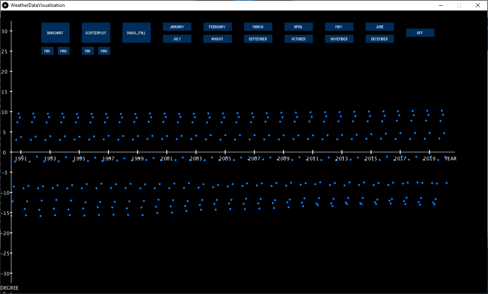
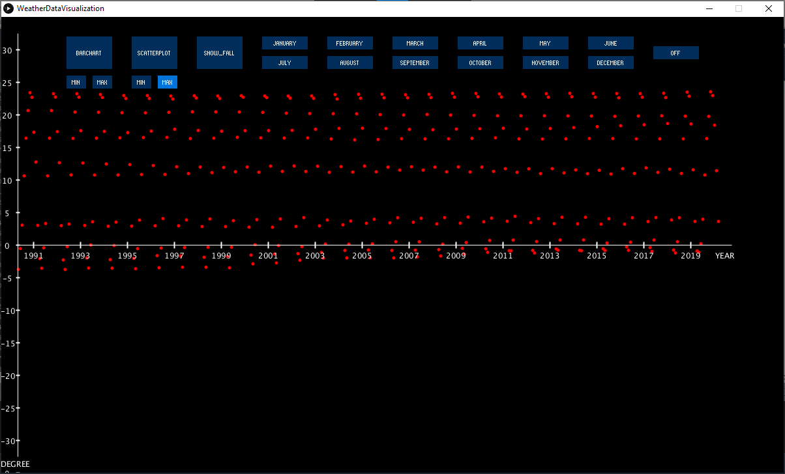
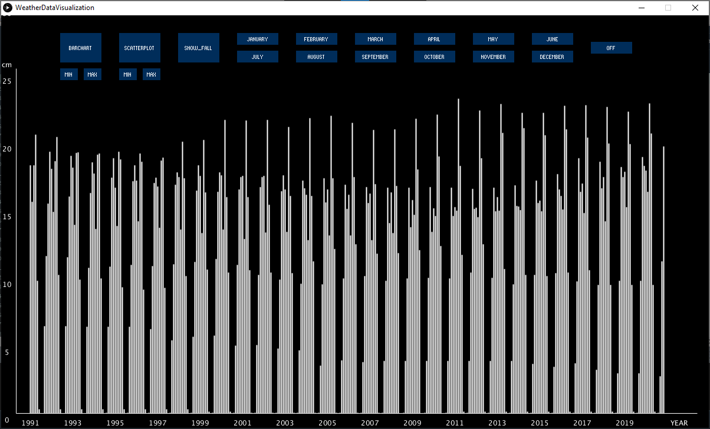
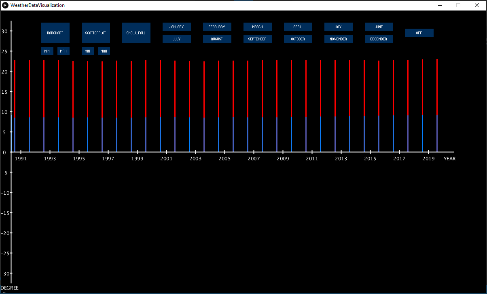

# Weather Data Visualization 
**Author: Bilal Dawood**

## About the program and what it does:
The following program takes in infomation regarding the weather of Calgary for the last 50 years (1969-2019). The data is grouped, and the program displays the maximum and minimum weather from each month (read and collected from the excel sheet), and also checks whether or not there was snowfall in that month.

The interactive GUI lets you:
- Customize the way you want the data to be displayed (scatterplot/bar chart)
- What information you want see (only minimum, maximum, snowfall for all or even specific months)
- If you want see the weather (in Celcius), or just the snowfall (in cm)

## How it works:

The program is run from the Processing-Java-based IDE. The following GUI appears when the program successfully runs. 

The buttons on the top are interactive, and allows the user to choose what type of data they want to see, allows the user to narrow down the data visible, and also allows the use to choose which graph format they prefer. 

Below, the user selected "Barchart" > "Min"

Below the user selected "Barchart" > Max"

Below, the user selected "Scatterplot"

Below, the user selected "Scatterplot" > "Min"

Below the user selected "Scatterplot" > Max"

If wanted, the user can also see how many centimeters of snowfall there was in a specific month, as shown below.

Lastly, the user can also narrown down the visible information by selecting which months they want to see the data from. 

In the image below, the user has selceted the month "January"

